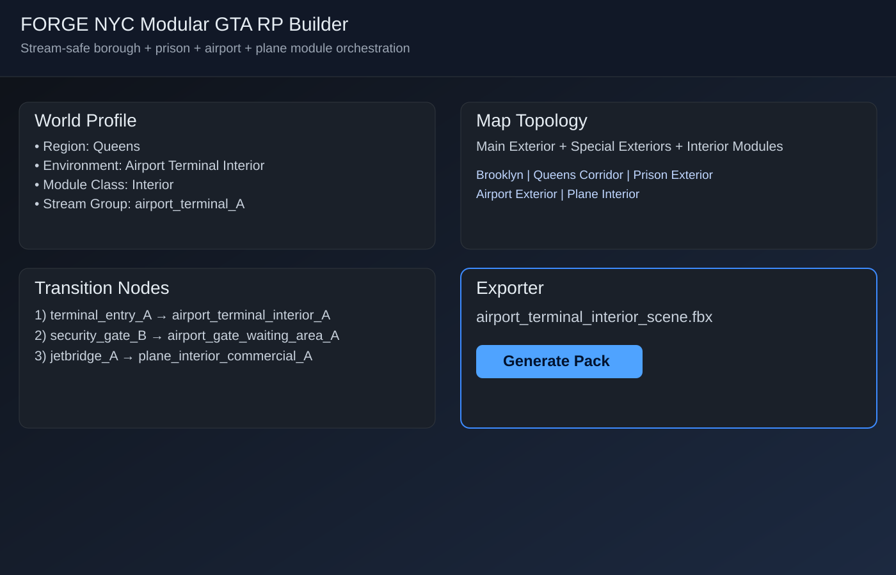

# FORGE UI Preview (Mock)

This repository previously had no runnable web UI. To answer "how the app looks," this mock screen shows the intended dashboard layout for the modular NYC bundle.

## Included mock components

- Header with FORGE NYC module context
- World Profile panel
- Map Topology panel
- Transition Nodes panel
- Exporter panel

Preview image:

## Run locally (static preview)

Open `web/index.html` in a browser.
